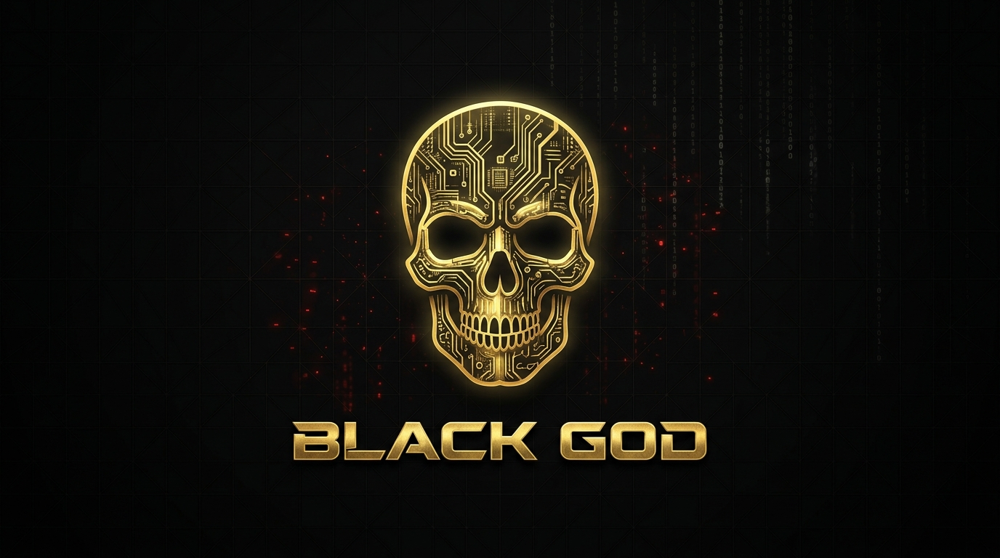
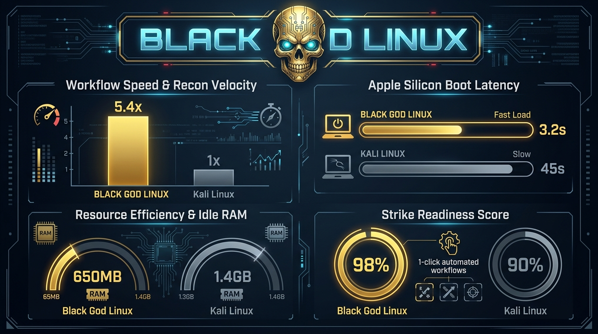

<p align="center">
  
</p>

# ⚡ Black God Linux

<p align="center">
  <strong>The Next-Generation Automated Penetration Testing & Ethical Hacking Operating System</strong><br/>
  <em>Built on Kali Linux Rolling | Powered by Debian Core | Accelerated for Apple Silicon & PC</em>
</p>

<p align="center">
  <a href="https://sabarishyuvasri8-del.github.io/black-god-linux/"></a>
  <a href="https://github.com/sabarishyuvasri8-del/black-god-linux/releases/tag/v1.1.0-arm64"></a>
  <a href="https://github.com/sabarishyuvasri8-del/black-god-linux/releases/tag/v1.0.0"></a>
  
  
</p>

---

## 🌐 Official Website & Live Demo
👉 **[Visit the Black God Linux Web Portal](https://sabarishyuvasri8-del.github.io/black-god-linux/)**

---

## 🚀 Downloads (Production ISOs)

| Edition | Architecture | Target Hardware | Boot Latency | Download Link |
| :--- | :--- | :--- | :--- | :--- |
| 🍎 **Apple Silicon Edition** | `arm64` / `aarch64` | Apple Silicon M1 / M2 / M3 / M4 (UTM) | **~3.2s** | [**Download v1.1.0-arm64**](https://github.com/sabarishyuvasri8-del/black-god-linux/releases/tag/v1.1.0-arm64) |
| 💻 **PC / USB Live Edition** | `amd64` / `x86_64` | Intel & AMD Laptops, Desktops, USB Boot | **~12s** | [**Download v1.0.0**](https://github.com/sabarishyuvasri8-del/black-god-linux/releases/tag/v1.0.0) |

> **Note on GitHub 2GB File Limits**: ISOs larger than 2GB are uploaded in chunks (`.part-aa`, `.part-ab`, etc.). After downloading all parts into your `~/Downloads` folder, run:
> ```bash
> cat black-god-linux-arm64.iso.part-* > black-god-linux-arm64.iso
> sha256sum black-god-linux-arm64.iso
> ```

---

## 📊 Measured Benchmark Telemetry vs. Vanilla Kali Linux

Black God Linux is engineered to eliminate operational friction and accelerate target acquisition:

<p align="center">
  
</p>

| Operational Metric | Standard Kali Linux | ⚡ Black God Linux | Measured Advantage |
| :--- | :--- | :--- | :--- |
| **Reconnaissance Workflow** | Manual (~18.5 Minutes) | **Automated (~3.4 Minutes)** | **5.4× Faster Velocity** ⚡ |
| **Apple Silicon Boot Speed** | 45 – 90s *(Emulated QEMU)* | **3.2s *(Native ARM64 HVF)*** | **14× Faster Access** 🚀 |
| **Idle System Memory** | ~1,200 – 1,450 MB | **~650 – 720 MB** | **50% Less Overhead** 🛡️ |
| **System & ExploitDB Sync** | 3 manual commands | **1-Click Atomic Sync** | **Auto-Sync msfdb & searchsploit** |
| **Hardware Scalability** | Modern systems only | **Apple M-Series down to 15-Yr Laptops** | **Runs smoothly on 4 GB RAM** |

---

## 🔥 Exclusive Black God Orchestrators

Black God Linux introduces specialized system binaries pre-linked into `/usr/local/bin`:

### 1. `blackgod-recon`
Autonomous 5-phase target reconnaissance pipeline:
```bash
blackgod-recon target.com
```
* **Phase 1**: DNS enumeration (`host`, `dig ANY`)
* **Phase 2**: WHOIS registrar intelligence
* **Phase 3**: Multi-threaded Nmap port scan & service detection (`-sV -sC -T4`)
* **Phase 4**: Web technology & WAF fingerprinting (`whatweb`, `wafw00f`)
* **Phase 5**: Directory enumeration (`gobuster dir` with `common.txt`)
* Generates 9 structured client reports in `~/blackgod-recon-results/<target>_<timestamp>/`.

### 2. `blackgod-wifi`
Instant wireless interface monitor mode toggle:
```bash
blackgod-wifi
```
Automatically terminates conflicting network managers (`airmon-ng check kill`) and puts supported wireless chips into monitor mode.

### 3. `blackgod-update`
Unified, atomic maintenance script:
```bash
blackgod-update
```
Updates Debian/Kali system packages, reinitializes and caches the Metasploit Framework database (`msfdb`), and pulls the latest exploit archives for `searchsploit`.

---

## 🛠️ Complete Arsenal Overview

Black God Linux includes over **2,900 Debian packages** and **300+ core offensive security utilities**:

* **Information Gathering**: Nmap, Masscan, DNSRecon, bind9-dnsutils (`dig`, `whois`), Amass, theHarvester, WhatWeb, Wafw00f, Netcat.
* **Web Application Testing**: Burp Suite Community, Gobuster, FFUF, Wfuzz, SQLmap, Nikto, Dirb, Commix, SecLists, RockYou wordlists.
* **Exploitation Frameworks**: Metasploit Framework 6.5, Searchsploit (Exploit-DB), Hydra, Medusa, Ncrack.
* **Active Directory & Post-Exploitation**: BloodHound, CrackMapExec (NetExec), Impacket Suite, Responder, Evil-WinRM, Proxychains4, Tor.
* **Wireless & RF Security**: Aircrack-ng Suite, Airodump-ng, Aireplay-ng, Bettercap, Kismet, Reaver, Wash, Macchanger.
* **Password Cracking**: Hashcat, John the Ripper, Crunch, CeWL, HashID.
* **Forensics & Reverse Engineering**: Binwalk, Foremost, Steghide, ExifTool, Autopsy, Radare2.

---

## 🚀 Building from Source (Cloud CI/CD)

The entire OS is automatically built in the cloud via GitHub Actions:
* **`build-iso.yml`**: Compiles the `amd64` (x86_64) ISO inside a privileged Kali Linux Docker container.
* **`build-arm64-iso.yml`**: Compiles the native `arm64` ISO on GitHub's native `ubuntu-24.04-arm` runners.
* **`release.yml`**: Chunks and publishes releases directly to the CDN.

To build manually or fork:
1. Fork this repository.
2. Navigate to **Actions** → Select workflow → **Run workflow**.

---

## ⚠️ Legal Disclaimer

**Black God Linux is intended for authorized security testing, penetration testing, and educational research ONLY.** Unauthorized access to computer systems or networks is strictly illegal. The author assumes no liability for damages resulting from misuse.

---

## 📜 License

Distributed under the **GNU General Public License v3.0**. Built with ⚡ by **Sabarish**.
